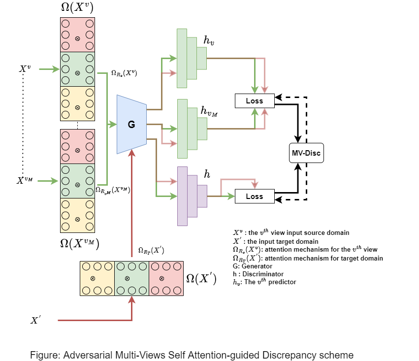

# Adversarial-Multi-View-Attention-guided-Discrepancy
We develop an adversarial network domain adaptation algorithm in the regression setting. The algorithm tries to find features shared by the domains during the training process for the regression task. 

