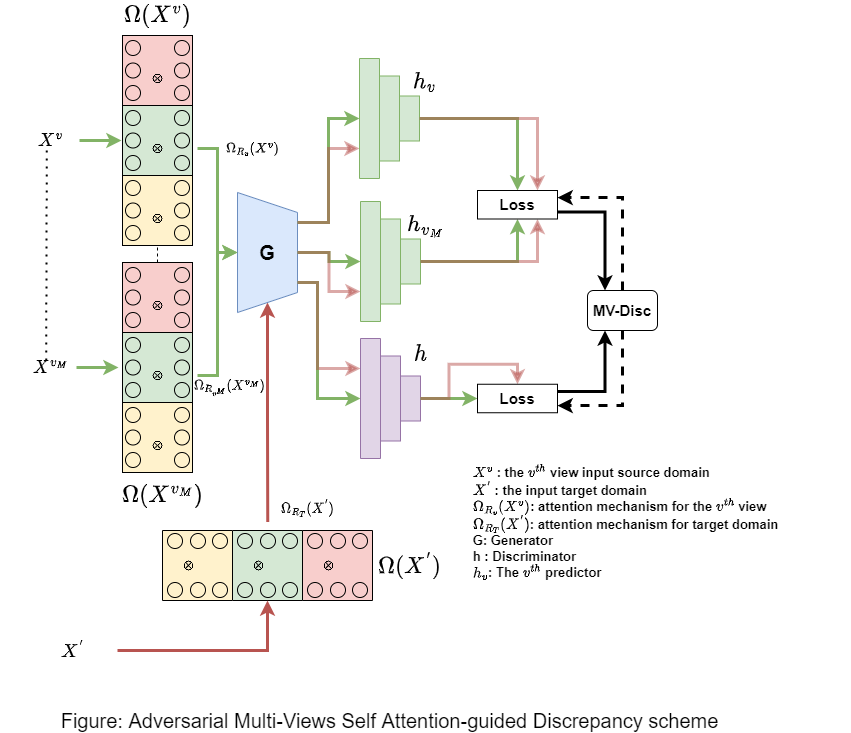

# Adversarial-Multi-View-Attention-guided-Discrepancy
We develop an adversarial network domain adaptation algorithm adjusting for the regression task. The algorithm tries to find features shared by the domains. 

